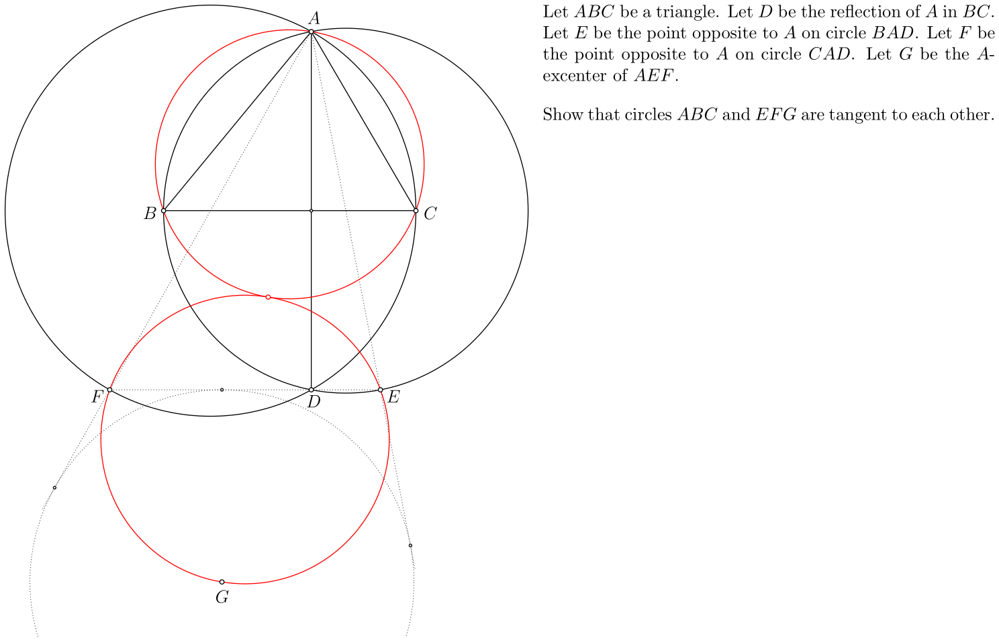

# Automated Generation of Planar Geometry Olympiad Problems (Patrik Bak)

This software generates geometry problems suitable for mathematical contests, including the IMO. See the [list of already proposed problems](#generated-problems).

It was developed as my [master thesis](https://drive.google.com/file/d/1dsaxDCMzlAPfB3e4rd8ut2RuZ_sn2Zm5/view?usp=sharing).

An example of a non-trivial generated problem whose wording, and figure were entirely generated by the software:
 
  

## Generated problems

Here is a list of problems that have been created with the aid of the software. Many of them have been generated during the "big experiment" described in the [thesis, page 56](https://drive.google.com/file/d/1dsaxDCMzlAPfB3e4rd8ut2RuZ_sn2Zm5/view?usp=sharing).

1. IMO 2022, P4 ([statement](https://artofproblemsolving.com/community/c3081085_2022imo_problems)) -- the story how the software helped to generate it is in the [solution thread](https://artofproblemsolving.com/community/c6h2883216p25677071)

1. ISL 2020, G6 ([statement](https://artofproblemsolving.com/community/c2409205_2020_isl)) -- generated in the big experiment and stated without modification

1. ISL 2020, G3 ([statement](https://artofproblemsolving.com/community/c2409205_2020_isl)) -- generated in the big experiment in a version where _D_ was the reflection of _B_ in the midpoint of _AC_, then generalized after solving

1. IGO 2020, A2 ([statement](https://artofproblemsolving.com/community/c1472958_2020_iranian_geometry_olympiad)) -- generated in the big experiment and stated without modification

1. MEMO 2021, I3 ([statement](https://artofproblemsolving.com/community/c2459522_2021_middle_european_mathematical_olympiad)) -- generated in the big experiment in a version where _D_ was the projection of _A_ onto _BC_, then generalized after solving

1. CPS 2021, P2 ([statement](https://artofproblemsolving.com/community/c2420819_2021_czechpolishslovak_match)) -- generated in the big experiment and stated without modification

1. CPS 2020, P1 ([statement](https://artofproblemsolving.com/community/c1336856_2020_czechpolishslovak_match)) -- generated in the big experiment and slightly restated

_(The list is not exhaustive, it does not include many easier problems used in Czech-Slovak local competitions)_

See also the examples from Appendix of the [thesis](https://drive.google.com/file/d/1dsaxDCMzlAPfB3e4rd8ut2RuZ_sn2Zm5/view?usp=sharing).

## How it works

### 1. Generation

The algorithm iteratively adds new objects (lines, points, circles) to an initial configuration. It manages combinatorial explosion through optimization techniques and verifies theorems probabilistically using analytic geometry.

### 2. Filtering

To identify difficult problems, the system uses an automated theorem prover optimized for speed. If the prover can easily prove a theorem, the problem is considered too simple. Remaining theorems are ranked by a heuristic system based on expert problem-writing experience.

## Getting Started

You can download the latest pre-built release from the [GitHub Releases](https://github.com/PatrikBak/GeoGen/releases) page.

Unzip the downloaded archive and run the executable for your platform (e.g., `GeoGen.exe` on Windows).

## Documentation

- **[User Guide](UserGuide.md)**: Usage instructions for running the application and understanding outputs.
- **[Input/Output Format Reference](InputOutputFormat.md)**: Complete technical specification including all constructions, input file formats, and output file structures.
- **[Developer Guide](DeveloperGuide.md)**: Instructions for building the source code and running tests.

## Contact

If you are interested in my project, or if you have any other question, contact me via [email](mailto:patrik.bak.x@gmail.com).
